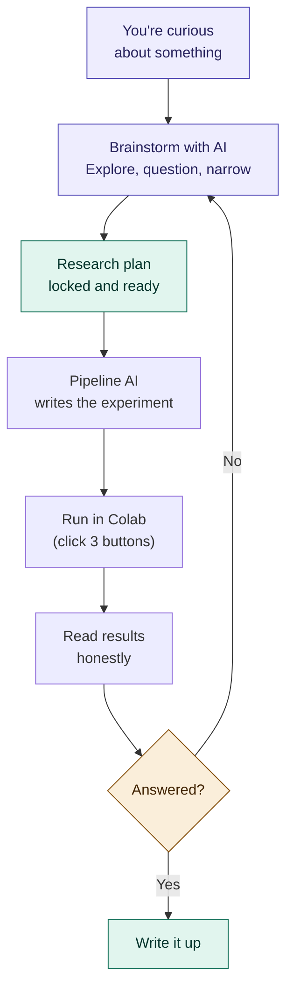

# Aegis

### You have a research question. This helps you answer it properly.

Aegis is a free tool that gives you the same research discipline
that PhD students spend years learning — the habits that separate
"I think I found something" from "I can prove I found something."

You don't need a degree. You don't need a lab. You need a question,
a computer, and the willingness to be honest about what your data
actually shows.

> **What does Aegis actually do?**
> It tracks your experiments so you always know where you are,
> checks your work so mistakes don't snowball, saves everything
> so nothing gets lost, and structures your process so your own
> biases don't contaminate your results.

Named after Athena's shield — it protects your research while you
do the thinking.

---

## Who is this for?

- You're curious about something and want to study it properly
- You're working on your own — no lab, no advisor, no team
- You want your findings to be credible, not just interesting
- You don't need to know how to code

**Don't know Python?** The AI writes all the code for you.
**Don't know statistics?** See [docs/CONCEPTS.md](docs/CONCEPTS.md)
— every term explained in plain English.
**Never done research before?** That's exactly who this is for.

---

## What research actually looks like

Most people think research is: run experiment → get answer.

It's actually two phases:

**Phase 1: Think** (with your Brainstorm AI)

Have a curiosity → explore it → narrow it → check if it's been
done → decide what you'd measure → decide what would prove you
wrong → get a research plan

**Phase 2: Do** (with your Pipeline AI + Colab)

Paste the plan → AI writes the code → you run it → AI explains
the numbers → you interpret what it means

Aegis handles all of Phase 2. Your job is Phase 1 — the thinking.



---

## Start here

### Step 1: Set up your project (2 minutes, one time only)

1. Go to [colab.research.google.com](https://colab.research.google.com)
   and sign in with your Google account
2. Click **"New notebook"**
3. You'll see an empty text box with a ▶ play button — this is
   called a "cell." Click inside it and paste this text:

```python
!pip install -q numpy
import urllib.request
urllib.request.urlretrieve(
    "https://raw.githubusercontent.com/RenSolvyn/aegis-framework/main/examples/colab_setup.py",
    "setup.py")
exec(open("setup.py").read())
```

4. Click the ▶ play button (or press Shift+Enter)
5. It will ask to connect to Google Drive — click **"Connect"**
6. Wait about 30 seconds. When you see **"Setup complete!"** —
   you're done. Everything is on your Google Drive now.


### Step 2: Set up your AI assistants (one time only)

You need two AI conversations — one for thinking, one for doing.

**For Claude users (easiest):**

1. Go to [claude.ai](https://claude.ai) → create a Project called
   **"Research Brainstorm"**
2. Open [this file](https://raw.githubusercontent.com/RenSolvyn/aegis-framework/main/prompts/brainstorm_prompt.md),
   select all (Ctrl+A), copy (Ctrl+C), paste as the project's
   system instructions
3. Create another Project called **"Aegis Pipeline"**
4. Open [this file](https://raw.githubusercontent.com/RenSolvyn/aegis-framework/main/prompts/creator_prompt.md),
   select all, copy, paste as system instructions

**For ChatGPT users:** same files, create two Custom GPTs.
**For other AI:** paste the file contents as your first message.

Done. Two AI assistants, set up forever.

### Step 3: Brainstorm your research question

Open your **Research Brainstorm** AI and just talk:

> "I wonder if coffee makes plants grow faster"

The AI explores the idea with you — asks questions, challenges
assumptions, suggests angles you haven't considered. Take your
time. Good questions come from messy exploration.

When the question is sharp enough, the AI produces a
**RESEARCH PLAN** block. Copy it.

### Step 4: Run the experiment

1. Open your **Aegis Pipeline** AI and paste the RESEARCH PLAN
2. The AI writes the experiment script — copy it
3. Open **Research/Aegis_Research_Session.ipynb** on Drive
   and paste the script into Cell 2
4. Run all 3 cells (▶ ▶ ▶)
5. Copy the results between the markers and paste back to the
   Pipeline AI — it explains every number and asks you to think
   critically about what you found

**That's the whole workflow.** Brainstorm → plan → paste → run →
interpret. The only thing you do is think.

### What happens next?

After your first experiment, you'll either have an answer or a
new question. If you have a new question, go back to your
Brainstorm AI and explore it. If you want to refine the same
question, stay in the Pipeline and say "let's adjust and run
again." The Pipeline will write a new script.

Your dashboard (Cell 1 of the notebook) always shows where you
are: how many experiments you've run, how much budget you've used,
and what happened last time.

When you're ready to share your findings, tell the Pipeline AI:
"check if my research is ready to publish." For extra rigor,
paste your scripts into a third AI conversation using
`prompts/auditor_prompt.md` for independent code review.

### Prefer working on your own computer?

If you have Python installed:
```
git clone https://github.com/RenSolvyn/aegis-framework.git
cd aegis-framework
python3 bootstrap.py my-research "What I'm Studying" 100
```

For the complete walkthrough with troubleshooting, see
**[docs/FIRST_SESSION.md](docs/FIRST_SESSION.md)**.

---

## What Aegis does for you

**Remembers where you are.** Every experiment is tracked — which
session, what ran, whether it worked, how long it took. Come back
tomorrow and the dashboard shows exactly where you left off.

**Keeps you honest.** Your predictions are locked before the
experiment runs. Cell 3 shows them next to the actual results —
generated by code, not AI, so it can't be softened or spun.

**Catches mistakes.** Every script is self-audited before you see
it. Every result file gets a mathematical fingerprint. Budget
warnings fire at 75% and 90%.

**Saves everything.** Results go to Google Drive automatically.
If something crashes, it's logged and you can pick up where you
left off.

Everything is saved automatically. If something crashes,
it's logged and you can pick up where you left off.

---

## How Aegis keeps you honest

The biggest risk of working alone: you believe your own results
because you want them to be true.

Aegis prevents this at every layer:

- **Brainstorm AI** kills bad questions before you waste time
- **Pipeline AI** locks predictions before computation (can't
  change your hypothesis after seeing the data)
- **Self-audit** checks every script for common errors before
  you run it
- **Cell 3** shows raw numbers — you see exactly what happened,
  not a filtered summary
- **Devil's advocate** questions after every result force you
  to consider alternative explanations

For publication-quality research, add the **Auditor** — a
separate AI conversation that reviews your code without seeing
the Pipeline's reasoning. This catches bugs the self-audit
misses. Set it up with `prompts/auditor_prompt.md`.

---

## Your project on Google Drive

After setup, your Drive looks like this:

```
Research/
├── Aegis_Research_Session.ipynb  ← open this every session
├── scripts/    ← your experiments (auto or drag-in)
├── results/    ← outputs (automatic)
├── prompts/    ← AI instructions (already downloaded)
├── docs/       ← guides + concepts glossary
├── src/        ← framework engine (don't edit)
└── program_state.json  ← tracks everything
```

---

## What's in this repo

| File | What it does |
|------|-------------|
| `bootstrap.py` | **Start here (local).** Creates your project in one command |
| `examples/colab_setup.py` | **Start here (Colab).** Creates Drive structure in one cell |
| `docs/FIRST_SESSION.md` | Complete walkthrough from zero to first experiment |
| `docs/CONCEPTS.md` | Research concepts in plain English (what's a p-value?) |
| `docs/GUIDE.md` | Research methodology, conventions, design patterns |
| `docs/SETUP.md` | GitHub and version control setup |
| `prompts/brainstorm_prompt.md` | AI for exploring your research question |
| `prompts/creator_prompt.md` | AI for writing and running experiments |
| `prompts/auditor_prompt.md` | AI for independent code review (optional, for publication) |
| `src/research_runner.py` | The engine that tracks everything |
| `src/scientific_method.py` | Pre-registration, power analysis, adversarial review |
| `src/extensions.py` | Plugin system — add custom checks without editing source |
| `src/git_sync.py` | Auto-saves to GitHub from Colab (optional) |
| `tests/test_aegis.py` | 38 tests verifying every component |

---

## FAQ

**Do I need to know how to code?**
No. The setup puts AI prompts on your Google Drive. You set up
two AI conversations (Brainstorm + Pipeline), describe what you
want to study, and the AI writes all the code. You copy-paste
between your AI and Colab. You never touch Python.

**Do I need a GPU?**
Only if your research needs one (like deep learning). Aegis
itself runs on any computer. Colab provides a free GPU if needed.

**Do I need GitHub?**
No. It adds version history, but Aegis works without it. Start
without GitHub. Add it when you're ready.

**Is this only for machine learning?**
No. The runner tracks any Python experiment — data analysis,
simulations, statistics, anything. The patterns apply to all
empirical research.

**How is this different from just writing Python scripts?**
Without Aegis, your 15th experiment overwrites your 14th. You
forget which script produced which result. You can't prove what
you predicted before seeing the data. Aegis makes research
*traceable* and *honest*.

**What's a p-value? I don't understand statistics.**
See [docs/CONCEPTS.md](docs/CONCEPTS.md) — every research
concept explained in plain English, the way you'd explain it to
a friend. No jargon, no equations. The Pipeline AI also explains
results in plain language after every experiment.

**I'm not in academia. Can I still do research?**
Absolutely. Research is a method, not a credential. If you have
a question, a plan, and the honesty to accept what the data shows,
you're doing research. Aegis gives you the structure that
institutions provide to their students — without the institution.

**What if my experiment fails or crashes?**
The error is auto-logged. Nothing is lost. Open your Brainstorm
AI and describe what happened — it'll help you figure out what
went wrong and try a different approach.

---

> *"Research is formalized curiosity. It is poking and prying
> with a purpose."* — Zora Neale Hurston

**License:** Apache 2.0 — free to use, modify, share.
**Cite:** Click "Cite this repository" or see CITATION.cff.

---

## Current limitations (we're honest about these)

- **Requires internet and a computer.** People without reliable
  access can't use Aegis yet. Offline and mobile versions are
  on the roadmap.
- **Requires basic digital literacy.** Opening Colab, pasting
  text, saving files to Drive. We've minimized this but not
  eliminated it.
- **Doesn't teach domain expertise.** Aegis ensures your process
  is sound, but it can't tell you whether your research question
  is important in your field. Talk to people who know the domain.
- **AI assistants can be wrong.** The Brainstorm and Pipeline AIs
  can make mistakes. The self-audit, blind comparison, and devil's
  advocate questions catch most errors, but your judgment is always
  the final authority.
