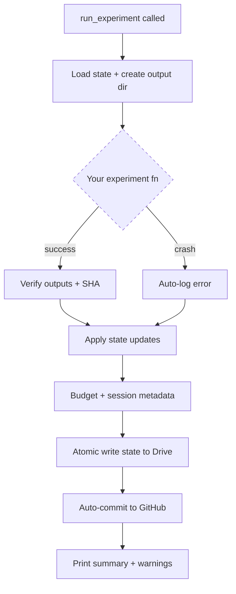
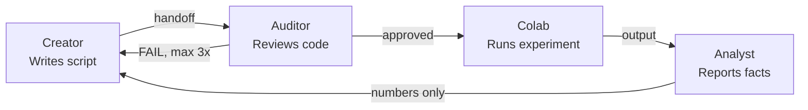
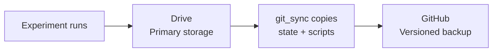

# Aegis

**Audited Execution Governance for Independent Science**

Research discipline for solo researchers running multi-phase experiments on cloud GPU.

Named for Athena's shield — it doesn't fight for you, it protects you while you fight. You focus on the science. Aegis handles session tracking, output verification, budget management, crash recovery, version control sync, and the structured process that prevents your own biases from corrupting your results.

> **Cite this work:** Click "Cite this repository" on GitHub, or see [CITATION.cff](CITATION.cff).

---

## The problem

You're one person doing multi-session research. Things go wrong:
- Session 12 crashes. Where were you? What ran? What's the budget?
- Session 15 produces weird numbers. You don't notice until Session 20.
- You calibrate a threshold in Session 4. Session 23 hardcodes a different one.
- You write a script, run it, read the output, decide it confirms your hypothesis. Nobody checks any of those steps.

This framework makes those problems structurally impossible.


## What's in the box

```
solo-research-framework/
├── src/
│   ├── research_runner.py       # Runner + dashboard
│   └── git_sync.py              # Auto-commit from Colab
├── templates/
│   ├── program_state_template.json
│   ├── script_template.py
│   └── handoff_templates.md
├── examples/
│   ├── example_calibration.py   # Working experiment
│   └── colab_3cell_template.py  # Copy-paste Colab session
├── docs/
│   ├── SETUP.md                 # Getting started (all skill levels)
│   └── GUIDE.md                 # Methodology + conventions + patterns
├── paper/
│   └── preprint_outline.md      # arXiv preprint template
├── CITATION.cff
└── LICENSE                      # Apache 2.0
```


## Quick start (5 minutes)

1. Copy `src/research_runner.py` to your project
2. Copy `templates/program_state_template.json` → `program_state.json`, fill in your program name and budget
3. Write your experiment using `templates/script_template.py` as a starting point
4. Run it

```python
from research_runner import run_experiment, save_result, dashboard

# See where you are
dashboard()

# Your experiment
def experiment(output_dir, program_state):
    results = {"accuracy": 0.87}
    save_result(f"{output_dir}/results.json", dict(results))
    return {"state_updates": {"features.X.accuracy": 0.87}}

run_experiment(experiment_fn=experiment, phase="phase_0",
               work_unit="WU-0.01", expected_outputs=["results.json"])
```

For GitHub setup, auto-commit from Colab, and non-technical
onboarding, see `docs/SETUP.md`.


## How it works

### The dashboard

Run `dashboard()` at the start of every session. It reads
`program_state.json` and tells you everything:

```
======================================================
  Session 9
  Phase: pre_gate
  Last: WU-PG.03 → COMPLETE
  Budget: 6.0 / 100.0 hrs (6.0% spent)
  Remaining: 94.0 hrs
  Anomalies: none
======================================================
```

You never have to remember where you are.

### The runner lifecycle



### The 3-role pipeline



You play all three roles, but in separate sessions with a break
between them. The handoff templates in `templates/` are the
structure that prevents your assumptions from leaking across roles.

### Parallel save (Drive + GitHub)



Drive is the runtime filesystem. GitHub adds version history on top.
Both always have the latest state. If either goes down, the other
has everything.


## Design patterns

See `docs/GUIDE.md` for full details. The highlights:

- **Negative-result architecture** — every outcome maps to a product, designed before you see data
- **Kill criteria** — non-negotiable stopping rules, checked automatically
- **Calibration-before-measurement** — null distributions from your setup, not from theory
- **Triage (A/B/C)** — pre-classify work units so you know what to cut under pressure
- **Error log lifecycle** — entries ride the handoff until they reach Colab and get written to disk


## Your Colab session (3 cells)

```python
# CELL 1: Setup (same every time)
from google.colab import drive
drive.mount('/content/drive')
import sys; sys.path.insert(0, "/content/drive/MyDrive/Research/src")
from research_runner import dashboard
from git_sync import git_setup
dashboard()
git_setup()

# CELL 2: Your experiment (the only cell that changes)
!python /content/drive/MyDrive/Research/scripts/your_script.py

# CELL 3: Usually unnecessary — runner auto-syncs to GitHub
```


## What this is NOT

- Not an experiment tracker (use W&B for dashboards)
- Not a pipeline orchestrator (use Snakemake for DAGs)
- Not an AI research agent (this keeps the human in the loop)
- Not a replacement for Google Drive (Drive stays your runtime filesystem)

This is the **discipline layer** between you and your experiments.
The part that makes one person work like a well-run team.

Named after the divine shield of Athena — because the best protection
for your research is structure, not armor.


## License

Apache 2.0. Use, modify, distribute freely. Attribution appreciated.
