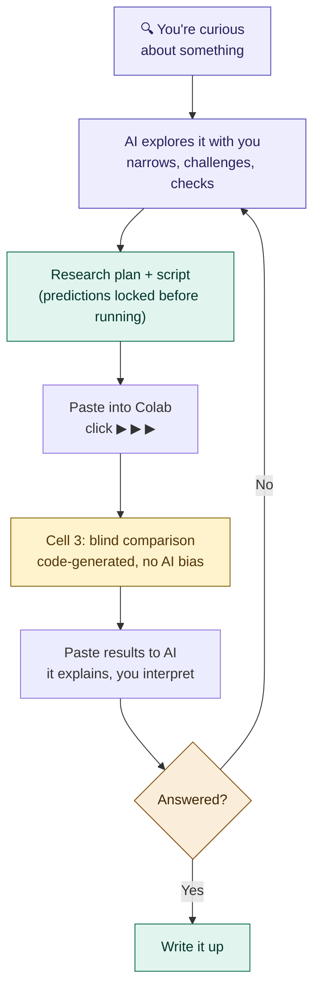

# Aegis

### You have a research question. This helps you answer it properly.

Aegis is a free tool that gives you the research process structure
that institutions provide — the habits that separate
"I think I found something" from "I can prove I found something."

You don't need a degree. You don't need a lab. You need a question,
a computer, and the willingness to be honest about what your data
actually shows.

> **What does Aegis actually do?**
> It tracks your experiments so you always know where you are,
> checks your work so mistakes don't snowball, saves everything
> so nothing gets lost, and structures your process so your own
> biases don't contaminate your results.

Named after Athena's shield — it protects your research while you
do the thinking.

---

## Who is this for?

- You're curious about something and want to study it properly
- You're working on your own — no lab, no advisor, no team
- You want your findings to be credible, not just interesting
- You don't need to know how to code

**Don't know Python?** The AI writes all the code for you.
**Don't know statistics?** See [docs/CONCEPTS.md](docs/CONCEPTS.md)
— every term explained in plain English.
**Never done research before?** That's exactly who this is for.

---

## What research actually looks like

Most people think research is: run experiment → get answer.

It's actually two phases:

**Phase 1: Think** — describe your curiosity, the AI helps you
sharpen it into a testable question and produces a research plan

**Phase 2: Do** — the AI writes the code, you paste it into Colab
and click 3 buttons, then paste the results back and the AI
explains what the numbers mean

The AI guides both phases. Your only job is the thinking — what
to study, and what the results mean for your question.



---

## Start here

### Step 1: Set up your project (2 minutes, one time only)

1. Go to [colab.research.google.com](https://colab.research.google.com)
   (Colab is Google's free tool for running code — like Google
   Docs but for experiments). Sign in with your Google account.
2. Click **"New notebook"**
3. You'll see an empty text box with a ▶ play button — this is
   called a "cell." Click inside it and paste this text:

```python
!pip install -q numpy
import urllib.request
urllib.request.urlretrieve(
    "https://raw.githubusercontent.com/RenSolvyn/aegis-framework/main/examples/colab_setup.py",
    "setup.py")
exec(open("setup.py").read())
```

4. Click the ▶ play button (or press Shift+Enter)
5. It will ask to connect to Google Drive — click **"Connect"**
6. Wait about 30 seconds. When you see **"Setup complete!"** —
   you're done. Everything is on your Google Drive now.


### Step 2: Set up your AI assistant (one time only)

1. Open [this link](https://raw.githubusercontent.com/RenSolvyn/aegis-framework/main/prompts/aegis_prompt.md)
   (you'll see a page of plain text — that's correct)
2. Select all (Ctrl+A), copy (Ctrl+C)
3. Open any AI (Claude, ChatGPT, Gemini, anything), start a new
   conversation, paste it as your first message
   *(It's a long text — that's normal. You paste it once and the
   AI becomes your research assistant.)*

That's it. One conversation. Ready to use.

**Optional (so you never paste again):**
- **Claude:** create a Project, paste as system instructions
- **ChatGPT:** create a Custom GPT with this as instructions

### Step 3: Do research (repeat this part)

1. Tell your AI what you're curious about:

   > "I wonder if coffee makes plants grow faster"

   For a quick exploration, be casual: *"quick test — does X
   correlate with Y?"* The AI adjusts automatically — less
   ceremony for exploring, more rigor for serious research.

2. The AI explores the idea with you — challenges assumptions,
   narrows the question, checks if it's already been answered.
   When the question is sharp enough, it produces a
   **RESEARCH PLAN** and the experiment script together.

3. Copy the script.

4. Open **Research/Aegis_Research_Session.ipynb** on Drive,
   paste the script into Cell 2, run all 3 cells (▶ ▶ ▶)
   *(Tip: bookmark this notebook — you'll reuse it every time)*

5. Copy the results between the markers and paste back to
   your AI — it explains every number and asks you to think
   critically about what you found

**That's the whole workflow.** Describe curiosity → AI sharpens it
→ AI writes code → you paste and click → AI explains results →
you interpret. One conversation, one notebook.

### What happens next?

After your first experiment, you'll either have an answer or a
new question. Just keep talking to the same AI — describe what
you want to try next, and it writes the next script.

Your dashboard (Cell 1) shows where you are: how many experiments
you've run, how much budget you've used, and what happened last.

When you're ready to share, tell the AI: "check if my research is
ready to publish." For extra rigor, use `prompts/auditor_prompt.md`
in a separate conversation for independent code review.

### Prefer working on your own computer?

If you have Python installed:
```
git clone https://github.com/RenSolvyn/aegis-framework.git
cd aegis-framework
python3 bootstrap.py my-research "What I'm Studying" 100
```

For the complete walkthrough with troubleshooting, see
**[docs/FIRST_SESSION.md](docs/FIRST_SESSION.md)**.

---

## What Aegis does for you

**Remembers where you are.** Every experiment is tracked — which
session, what ran, whether it worked, how long it took. Come back
tomorrow and the dashboard shows exactly where you left off.

**Keeps you honest.** Your predictions are locked before the
experiment runs. Cell 3 shows them next to the actual results —
generated by code, not AI, so it can't be softened or spun.

**Catches mistakes.** Every script is self-audited before you see
it. Statistical assumptions are tested at runtime (normality,
equal variance). Impossible values are flagged as errors. Budget
warnings fire at 75% and 90%.

**Saves everything.** Results go to Google Drive automatically.
The exact code that produced each result is saved alongside it.
A research log tracks every experiment across your project. If
something crashes, it's logged and you can pick up where you
left off.

---

## How Aegis keeps you honest

The biggest risk of working alone: you believe your own results
because you want them to be true.

Aegis prevents this at every layer:

- **Question killing** — the AI challenges bad questions before
  you waste time (already answered? unfalsifiable? too broad?)
- **Pre-registration** — predictions are locked before the
  experiment runs (SHA-256 verified, can't be changed after)
- **Self-audit** — every script is checked against 10 criteria
  before you see it (visible as "Audit: 10/10 passed")
- **Blind comparison** — Cell 3 shows predictions vs results,
  generated by code, not AI — can't be biased or softened
- **Assumption checks** — scripts automatically test whether
  the statistical test is appropriate for the data (normality,
  equal variance) and warn if assumptions are violated
- **Devil's advocate** — after every result, the AI forces you
  to consider what could disprove your finding

For publication-quality research, add the **Auditor** — a
separate AI conversation that reviews your code without seeing
the AI's reasoning. This catches bugs the self-audit
misses. Set it up with `prompts/auditor_prompt.md`.

---

## Your project on Google Drive

After setup, your Drive looks like this:

```
Research/
├── Aegis_Research_Session.ipynb  ← open this every session
├── scripts/    ← your experiments (auto or drag-in)
├── results/    ← outputs (automatic)
├── prompts/    ← AI instructions (already downloaded)
├── docs/       ← guides + concepts glossary
├── src/        ← framework engine (don't edit)
└── program_state.json  ← tracks everything
```

---

## What's in this repo

| File | What it does |
|------|-------------|
| `bootstrap.py` | **Start here (local).** Creates your project in one command |
| `examples/colab_setup.py` | **Start here (Colab).** Creates Drive structure in one cell |
| `docs/FIRST_SESSION.md` | Complete walkthrough from zero to first experiment |
| `docs/CONCEPTS.md` | Research concepts in plain English (what's a p-value?) |
| `docs/GUIDE.md` | Research methodology, conventions, design patterns |
| `docs/SETUP.md` | GitHub and version control setup |
| `prompts/aegis_prompt.md` | **The AI prompt.** Paste into any AI to start |
| `prompts/auditor_prompt.md` | Independent code review (optional, for publication) |
| `src/research_runner.py` | The engine that tracks everything |
| `src/scientific_method.py` | Pre-registration, power analysis, adversarial review |
| `src/extensions.py` | Plugin system — add custom checks without editing source |
| `src/git_sync.py` | Auto-saves to GitHub from Colab (optional) |
| `tests/test_aegis.py` | 55 tests covering core functionality |

---

## FAQ

**Do I need to know how to code?**
No. You paste one prompt into any AI, describe what you want to
study, and the AI writes all the code. You copy-paste between
your AI and Colab. You never touch Python.

**Do I need a GPU?**
Only if your research needs one (like deep learning). Aegis
itself runs on any computer. Colab provides a free GPU if needed.

**Do I need GitHub?**
No. It adds version history, but Aegis works without it. Start
without GitHub. Add it when you're ready.

**Is this only for machine learning?**
No. The runner tracks any Python experiment — data analysis,
simulations, statistics, anything. The patterns apply to all
empirical research.

**How is this different from just writing Python scripts?**
Without Aegis, your 15th experiment overwrites your 14th. You
forget which script produced which result. You can't prove what
you predicted before seeing the data. Aegis makes research
*traceable* and *honest*.

**What's a p-value? I don't understand statistics.**
See [docs/CONCEPTS.md](docs/CONCEPTS.md) — every research
concept explained in plain English, the way you'd explain it to
a friend. No jargon, no equations. The AI assistant also explains
results in plain language after every experiment.

**I'm not in academia. Can I still do research?**
Absolutely. Research is a method, not a credential. If you have
a question, a plan, and the honesty to accept what the data shows,
you're doing research. Aegis gives you the structure that
institutions provide to their students — without the institution.

**What if my experiment fails or crashes?**
The error is auto-logged. Nothing is lost. Describe what happened
to your AI — it'll help you figure out what went wrong and suggest
a different approach.

**Can I just explore without all the rigor?**
Yes. Say something casual like "quick test — does X relate to Y?"
The AI detects your intent and streamlines: fewer questions, plan
and script in one response, lighter ceremony. When you're ready
for serious research, just phrase it that way and the AI adjusts.

---

> *"Research is formalized curiosity. It is poking and prying
> with a purpose."* — Zora Neale Hurston

**License:** Apache 2.0 — free to use, modify, share.
**Cite:** Click "Cite this repository" or see CITATION.cff.

---

## Current limitations (we're honest about these)

- **The AI that explains results also wrote the hypothesis.**
  Cell 3's blind comparison (code-generated) gives you the
  unbiased numbers, but the AI's interpretation knows what you
  predicted. The devil's advocate questions counterbalance this.
  Your judgment is always the final check.
- **One conversation per research question.** After 4-5 experiments
  in one chat, start a fresh conversation — long chats lose context.
- **Requires internet and a computer.** Offline and mobile versions
  are on the roadmap.
- **Requires basic digital literacy.** Opening Colab, pasting text,
  navigating Drive. We've minimized this but not eliminated it.
- **Doesn't teach domain expertise.** Aegis ensures your process
  is sound, but can't tell you whether your question matters in
  your field. Talk to people who know the domain.
