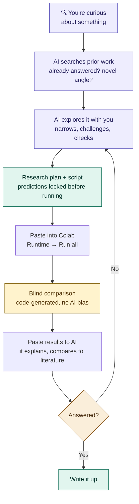

# Aegis

### You have a research question. This helps you answer it properly.

No degree needed. No coding needed. Just a question and a computer.

**[Jump to setup →](#start-here)** (2 minutes, free)

---

## Start here

### Step 1: Set up your project (2 minutes, one time only)

1. Go to [colab.research.google.com](https://colab.research.google.com)
   (Colab is Google's free tool for running code — like Google
   Docs but for experiments). Sign in with your Google account.
2. Click **"New notebook"**
3. You'll see an empty text box with a ▶ play button. Click
   inside it and paste this:

```python
!pip install -q numpy
import urllib.request
urllib.request.urlretrieve(
    "https://raw.githubusercontent.com/RenSolvyn/aegis-framework/main/examples/colab_setup.py",
    "setup.py")
exec(open("setup.py").read())
```

4. Click the ▶ play button
5. It will ask to connect to Google Drive — click **"Connect"**
6. Wait about 30 seconds. When you see **"Setup complete!"** —
   you're done.


### Step 2: Set up your AI assistant (one time only)

1. Open [this link](https://raw.githubusercontent.com/RenSolvyn/aegis-framework/main/prompts/aegis_prompt.md)
   (you'll see a page of plain text — that's correct)
2. Select all (Ctrl+A on Windows, Cmd+A on Mac), copy (Ctrl+C / Cmd+C)
3. Open any AI (Claude, ChatGPT, Gemini, anything), start a new
   conversation, paste it as your first message

That's it. The AI will greet you and ask what you want to study.

**Optional (so you never paste again):**
- **Claude:** create a Project, paste as system instructions
- **ChatGPT:** create a Custom GPT with this as instructions

### Step 3: Do research (repeat this part)

1. Tell your AI what you're curious about:

   > "I wonder if coffee makes plants grow faster"

2. The AI searches for prior work, sharpens your question, and
   writes an experiment script. Copy the script — it starts with
   `import os` and ends with `run_experiment(...)`.

3. Switch to your Colab notebook
   (**Research/Aegis_Research_Session.ipynb** on Drive).
   Click on the **second code box** (it says "PASTE YOUR
   EXPERIMENT SCRIPT BELOW"). Select everything in it and paste
   your script to replace it. Then click the **Runtime** menu at
   the top and choose **Run all**.

4. After it finishes, scroll down. You'll see:
   ```
   --------------------------------------------------
     COPY EVERYTHING BELOW TO YOUR AI
   --------------------------------------------------
   ```
   Copy everything between that line and `STOP COPYING HERE`.
   Switch back to your AI and paste it.

5. The AI explains what the numbers mean. You decide what it
   means for your question.

**That's the whole workflow.** Tell AI → copy script → paste and
run → copy results → paste back.
*(Tip: bookmark the notebook — you'll reuse it every time)*


### What happens next?

Keep talking to the same AI. Describe what you want to try next
and it writes the next script. When you're ready to share, tell
the AI: "check if my research is ready to publish."

---

## How it works

Aegis is a free tool that helps you study things properly — so
your findings are trustworthy, not just interesting.

> **What does it actually do?**
> It searches for prior work so you don't repeat what's known,
> locks your predictions before running so you can't fool yourself,
> checks your work so mistakes don't snowball, and saves everything
> so nothing gets lost.



### What Aegis does for you

**Searches before you start.** The AI looks up prior work — if
someone already answered your question, you'll know before
wasting time.

**Locks your predictions.** Before the experiment runs, your
predictions are mathematically sealed. You can't change them
after seeing the data — even by accident.

**Checks your work.** Every script is audited before you see it.
Statistical assumptions are tested automatically. Impossible
values are flagged. Budget warnings fire at 75% and 90%.

**Shows you the truth.** The last output shows your locked
predictions next to the actual results — generated by code,
not AI, so it can't be softened or spun.

**Saves everything.** Results, the exact code that produced them,
and a research log all go to Google Drive automatically.

### How it keeps you honest

The biggest risk of working alone: you believe your own results
because you want them to be true.

- **Prior work search** — the AI checks what's already known
- **Pre-registration** — predictions sealed before running
- **Self-audit** — 10 checks on every script, visible as
  "Audit: 10/10 passed"
- **Blind comparison** — code-generated, no AI bias
- **Assumption checks** — normality, equal variance tested
  automatically, warnings if violated
- **Devil's advocate** — the AI challenges every result

### For quick explorations

Say something casual: *"quick test — does X relate to Y?"*
The AI detects your intent and streamlines — fewer questions,
plan and script in one response. When you're ready for serious
research, just phrase it that way and the AI adjusts.

---

## FAQ

**Do I need to know how to code?**
No. The AI writes all the code. You copy-paste between your AI
and Colab.

**Do I need a GPU?**
Only if your research needs one. Colab provides a free GPU.

**Is this only for machine learning?**
No. It works for any experiment — data analysis, simulations,
statistics, anything.

**What's a p-value?**
See [docs/CONCEPTS.md](docs/CONCEPTS.md) — every term explained
like you'd explain it to a friend.

**What if my experiment crashes?**
The error is auto-logged. Nothing is lost. Tell your AI what
happened and it'll help you fix it.

**I'm not in academia. Can I still do research?**
Yes. Research is a method, not a credential. Aegis gives you the
tools that universities give their students.

---

## What's in this repo

| File | What it does |
|------|-------------|
| `examples/colab_setup.py` | **Start here (Colab).** One cell sets up everything |
| `bootstrap.py` | **Start here (local).** One command creates your project |
| `prompts/aegis_prompt.md` | **The AI prompt.** Paste into any AI to start |
| `prompts/auditor_prompt.md` | Independent code review (optional, for publication) |
| `docs/CONCEPTS.md` | Research concepts in plain English |
| `docs/FIRST_SESSION.md` | Complete walkthrough from zero |
| `docs/GUIDE.md` | Methodology, conventions, design patterns |
| `src/research_runner.py` | The engine that tracks everything |
| `src/scientific_method.py` | Pre-registration, blind analysis, power analysis |
| `tests/test_aegis.py` | 58 tests covering core functionality |

### Prefer working on your own computer?

```
git clone https://github.com/RenSolvyn/aegis-framework.git
cd aegis-framework
python3 bootstrap.py my-research "What I'm Studying" 100
```

See **[docs/FIRST_SESSION.md](docs/FIRST_SESSION.md)** for the
complete walkthrough.

---

## Current limitations

- **The AI that explains results also wrote the hypothesis.**
  The blind comparison layer (code-generated) provides the
  unbiased numbers. The devil's advocate questions help. Your
  judgment is always the final check.
- **One conversation per research question.** After 4-5 experiments,
  start fresh — long chats lose context.
- **Requires internet and a computer.**
- **Doesn't teach domain expertise.** Aegis ensures your process
  is sound, but can't tell you whether your question matters in
  your field.

---

> *"Research is formalized curiosity. It is poking and prying
> with a purpose."* — Zora Neale Hurston

**License:** Apache 2.0 — free to use, modify, share.
**Cite:** See CITATION.cff.
