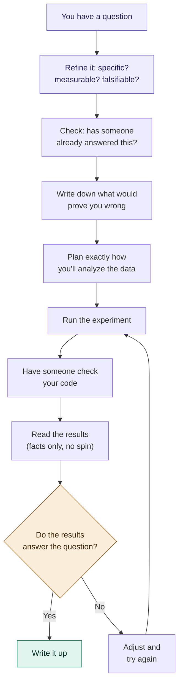
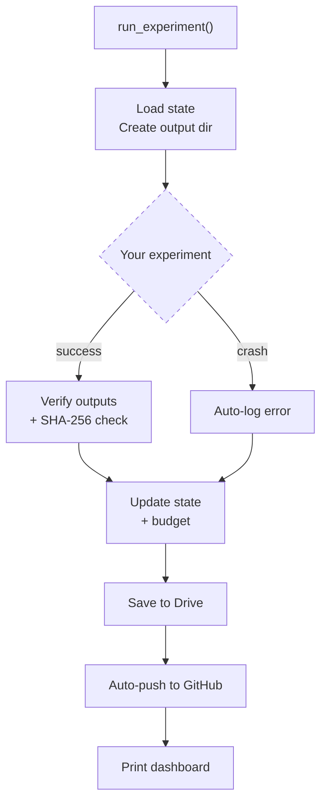
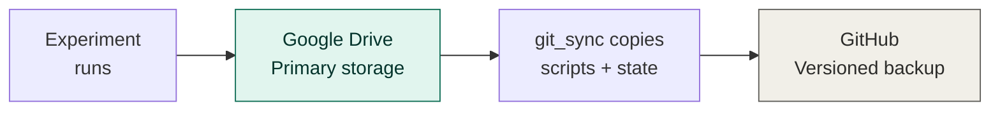
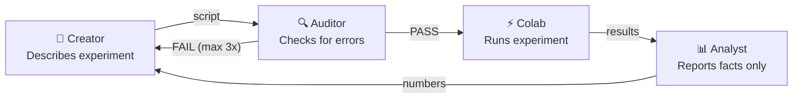
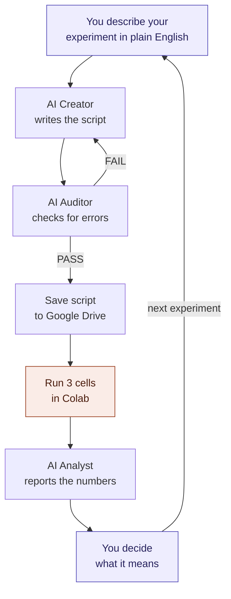

# Aegis

### You have a research question. This helps you answer it properly.

Aegis is a free tool that gives you the same research discipline
that PhD students spend years learning — the habits that separate
"I think I found something" from "I can prove I found something."

You don't need a degree. You don't need a lab. You need a question,
a computer, and the willingness to be honest about what your data
actually shows.

> **What does Aegis actually do?**
> It tracks your experiments so you always know where you are,
> checks your work so mistakes don't snowball, saves everything
> so nothing gets lost, and structures your process so your own
> biases don't contaminate your results.

Named after Athena's shield — it protects your research while you
do the thinking.

---

## Who is this for?

- You're studying something on your own — no lab, no advisor, no team
- You're running experiments on Google Colab (free GPUs) or your own computer
- You want your findings to be credible, not just interesting
- You've never used git, and that's fine

If you have a research question and basic Python knowledge (or
willingness to learn), you can use this.

**Don't know Python at all?** That's fine too. Aegis includes
AI prompts that translate your plain English into working
experiment scripts. You think, the AI codes, Aegis tracks.
**Jump to [Zero-code path](#zero-code-path-you-think-ai-codes) below.**

**Don't know what a p-value is?** Also fine. See
`docs/CONCEPTS.md` — every research term explained like you'd
explain it to a friend.

---

## What research actually looks like

Most people think research is: run experiment → get answer.

It's actually:

```
Have a question
    → Refine it: is it specific, measurable, falsifiable?
    → Check: has someone already answered it?
    → Plan what would prove you wrong
    → Plan exactly how you'll analyze the data
    → Calibrate your tools so you can trust them
    → Run the experiment
    → Have someone check your code (even if that "someone" is future-you)
    → Read the results without letting your hopes color what you see
    → Decide: do the results actually answer the question?
    → If yes: write it up. If no: adjust and try again.
    → Track everything so you (and others) can retrace your steps.
```

Aegis automates the tracking, checking, and organizing
so you can focus on the thinking.



---

## Start here

### Fastest path (30 seconds, Colab)

Open [colab.research.google.com](https://colab.research.google.com) → New notebook → paste this → run:

```python
!pip install -q numpy
import urllib.request
urllib.request.urlretrieve(
    "https://raw.githubusercontent.com/RenSolvyn/aegis-framework/main/examples/colab_setup.py",
    "setup.py")
exec(open("setup.py").read())
```

That's it. Your project is on Google Drive, the framework is
installed, and the smoke test passed. Follow the instructions
it prints for your next session.

### Local path (if you prefer your own computer)

Need Python 3.8+. Don't have it? Use the Colab path above.

```
python3 bootstrap.py my-research "What I'm Studying" 100
```

Don't know what a terminal is?
- **Mac:** Cmd+Space, type "Terminal," Enter
- **Windows:** Win key, type "PowerShell," Enter
- **Linux:** Ctrl+Alt+T

### Step 2: Write down your plan

Before any experiment, answer four questions in a file called
`docs/research_plan.md`:

1. **What am I trying to find out?**
2. **What would convince me I'm wrong?** (This is the hard one.
   If nothing could change your mind, it's not research — it's belief.)
3. **What are the steps?** List every experiment you plan to run.
4. **If my hypothesis is wrong, what do I still produce?**

This takes 10 minutes and is the most important thing you'll do.

### Step 4: Run your first experiment

See **`docs/FIRST_SESSION.md`** for the complete walkthrough with
copy-paste code, troubleshooting, and Colab setup.

---

## What Aegis does for you

### Remembers where you are
Every time you run an experiment, Aegis records which session this
is, what ran, whether it succeeded, how long it took, and how much
budget you've used. When you come back tomorrow, the dashboard
tells you exactly where you left off.

### Checks your outputs
Every result file gets a mathematical fingerprint. If a file gets
corrupted or accidentally changed, you'll know.

### Catches mistakes early
You write the script in one sitting, take a break, then review it
as if someone else wrote it. This catches bugs that would otherwise
snowball through your entire project.

### Keeps you honest about results
When you read your experiment's output, report what you see — the
actual numbers — before interpreting what they mean. The person who
runs the experiment shouldn't be the same person who decides what
it means, at least not in the same breath.

### Saves everything automatically
Results go to Google Drive. Scripts and state can auto-save to
GitHub. Your complete project history is always recoverable.

### Warns you when you're in trouble
Budget running low? The runner warns you at 75% and 90%. Hit a
stopping condition? The system flags it.

### How it all fits together



### Where your data lives



Drive is where Colab reads and writes. GitHub adds version history.
Both always have the latest state. If either goes down, the other
has everything.

---

## The three roles

The biggest risk of working alone: you believe your own results
because you want them to be true.

Aegis addresses this with three roles you play in sequence, with
a break between each:

**Creator** — write the experiment. Document what you assume and
what you're uncertain about.

**Auditor** — (after a break) review the code as if someone else
wrote it. Look for bugs, wrong assumptions, missing checks.

**Analyst** — (after running) report what the numbers say. Not
what you hoped. Not what they "probably" mean. Just the numbers.

You don't need to follow this strictly from day one. But the more
you separate "writing" from "checking" from "interpreting," the
more trustworthy your results become.



The key: **separate conversations**, not one. The Auditor works
because it can't see the Creator's reasoning. The Analyst works
because it doesn't know your hypothesis. See `prompts/handoff_guide.md`
for why this matters and how to do it in 40 seconds.

---

## Your project structure

```
my-research/
├── scripts/                 ← your experiments (you write these)
├── data/                    ← your datasets (you add these)
├── docs/                    ← your research plan and notes
├── results/                 ← experiment outputs (automatic)
├── logs/                    ← error log (automatic)
├── src/                     ← the Aegis engine (don't edit)
└── program_state.json       ← tracks everything (automatic)
```

You work in `scripts/`, `data/`, and `docs/`.
Everything else is managed for you.

---

## Learning path

```
Day 1       Bootstrap + run the example
            Read docs/FIRST_SESSION.md

Week 1      Write your first real experiments
            Start separating Creator from Auditor

Week 2+     Read docs/GUIDE.md for advanced patterns
            Add version control (docs/SETUP.md)
```

Start simple. Add structure as you need it.

---

## Zero-code path (you think, AI codes)

If you don't know Python, you can still do rigorous research.
Here's how:

**You need:** a research question, Google Colab (free), and
access to an AI assistant (Claude, ChatGPT, etc).

**The workflow:**



You touch two things: the plain English description and the
interpretation. Everything in between is handled.

**Step 1:** Set up three AI conversations using the prompts in
the `prompts/` folder:
- `creator_prompt.md` → paste into an AI conversation for writing scripts
- `auditor_prompt.md` → paste into a SEPARATE conversation for reviewing
- `analyst_prompt.md` → paste into a SEPARATE conversation for reading results

**Step 2:** Tell the Creator what you want to study:

> "I want to test whether [X] affects [Y]. I have [data].
> I predict [outcome]. If I see [opposite], I'm wrong."

The Creator will first help you refine your question — is it
specific enough? measurable? has someone already answered it?
Only after the question is solid does it write the experiment.

**Step 3:** Copy the script to the Auditor conversation:

> "Check this script for errors."

The Auditor returns PASS or FAIL. If FAIL, take the findings back
to the Creator to fix.

**Step 4:** Save the approved script to Google Drive (`Research/scripts/`).
Open the Colab notebook from `examples/colab_zero_code.py`. Change one
line (the script filename). Run all three cells.

**Step 5:** Copy the output to the Analyst conversation:

> "Report what the numbers say. Facts only."

**Step 6:** Bring the Analyst's report back to the Creator. Interpret.
Decide what to do next.

**The only thing you do is think.** What to study. What would prove
you wrong. What the results mean. The AI handles the code. Aegis
handles the tracking. Your job is the one thing AI can't do for you:
honest interpretation.

---

## What's in this repo

| File | What it does |
|------|-------------|
| `bootstrap.py` | **Start here (local).** Creates your project in one command |
| `examples/colab_setup.py` | **Start here (Colab).** Creates Drive structure in one cell |
| `docs/FIRST_SESSION.md` | Complete walkthrough from zero to first experiment |
| `docs/CONCEPTS.md` | Research concepts in plain English (what's a p-value?) |
| `docs/GUIDE.md` | Research methodology, conventions, design patterns |
| `docs/SETUP.md` | GitHub and version control setup |
| `prompts/creator_prompt.md` | AI prompt for writing experiment scripts |
| `prompts/auditor_prompt.md` | AI prompt for reviewing scripts |
| `prompts/analyst_prompt.md` | AI prompt for reading results (facts only) |
| `prompts/companion_prompt.md` | Unified mode for learning (casual use only) |
| `src/research_runner.py` | The engine that tracks everything |
| `src/scientific_method.py` | Pre-registration, power analysis, adversarial review |
| `src/extensions.py` | Plugin system — add custom checks without editing source |
| `src/git_sync.py` | Auto-saves to GitHub from Colab (optional) |
| `tests/test_aegis.py` | 24 tests verifying every component |

---

## FAQ

**Do I need to know how to code?**
No. The `prompts/` folder contains AI assistant prompts that
translate your plain English into working experiment scripts.
You describe what you want to measure, the AI writes the code,
another AI checks it, and you run it on Colab with three
copy-paste cells. You never edit Python. See "Zero-code path" above.

**Do I need a GPU?**
Only if your research needs one (like deep learning). Aegis
itself runs on any computer.

**Do I need GitHub?**
No. It adds version history, but Aegis works without it. Start
without GitHub. Add it when you're ready.

**Is this only for machine learning?**
No. The runner tracks any Python experiment — data analysis,
simulations, statistics, anything. The patterns apply to all
empirical research.

**How is this different from just writing Python scripts?**
Without Aegis, your 15th experiment overwrites your 14th. You
forget which script produced which result. You can't prove what
you did three months ago. Aegis makes research *traceable*.

**I don't understand statistics. What's a p-value?**
See `docs/CONCEPTS.md` — every research concept explained in
plain English, the way you'd explain it to a friend. No jargon,
no equations. The AI assistants also explain results in plain
language when they report.

**I'm not in academia. Can I still do research?**
Absolutely. Research is a method, not a credential. If you have
a question, a plan, and the honesty to accept what the data shows,
you're doing research. Aegis gives you the structure that
institutions provide to their students — without the institution.

---

> *"Research is formalized curiosity. It is poking and prying
> with a purpose."* — Zora Neale Hurston

**License:** Apache 2.0 — free to use, modify, share.
**Cite:** Click "Cite this repository" or see CITATION.cff.

---

## Current limitations (we're honest about these)

- **Requires internet and a computer.** People without reliable
  access can't use Aegis yet. Offline and mobile versions are
  on the roadmap.
- **Requires basic digital literacy.** Opening Colab, pasting
  text, saving files to Drive. We've minimized this but not
  eliminated it.
- **Doesn't teach domain expertise.** Aegis ensures your process
  is sound, but it can't tell you whether your research question
  is important in your field. Talk to people who know the domain.
- **AI assistants can be wrong.** The Creator, Auditor, and Analyst
  are AI — they can make mistakes. The 3-role separation catches
  most errors, but human judgment is always the final authority.
