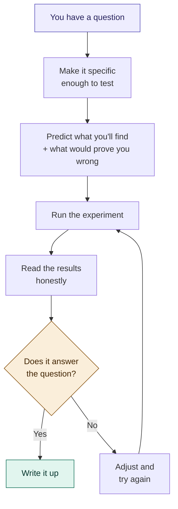
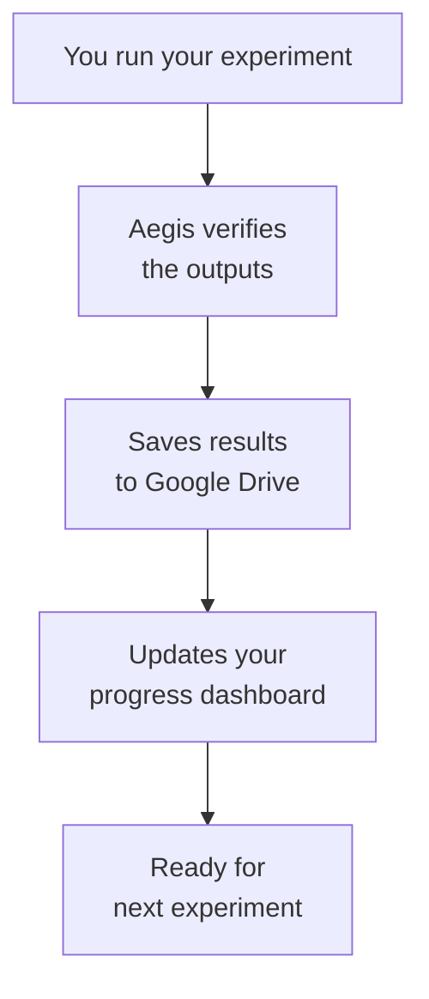
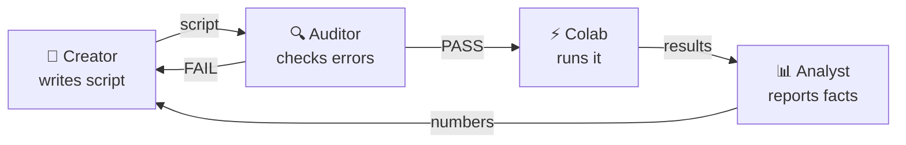

# Aegis

### You have a research question. This helps you answer it properly.

Aegis is a free tool that gives you the same research discipline
that PhD students spend years learning — the habits that separate
"I think I found something" from "I can prove I found something."

You don't need a degree. You don't need a lab. You need a question,
a computer, and the willingness to be honest about what your data
actually shows.

> **What does Aegis actually do?**
> It tracks your experiments so you always know where you are,
> checks your work so mistakes don't snowball, saves everything
> so nothing gets lost, and structures your process so your own
> biases don't contaminate your results.

Named after Athena's shield — it protects your research while you
do the thinking.

---

## Who is this for?

- You're curious about something and want to study it properly
- You're working on your own — no lab, no advisor, no team
- You want your findings to be credible, not just interesting
- You don't need to know how to code

**Don't know Python?** The AI writes all the code for you.
**Don't know statistics?** See [docs/CONCEPTS.md](docs/CONCEPTS.md)
— every term explained in plain English.
**Never done research before?** That's exactly who this is for.

---

## What research actually looks like

Most people think research is: run experiment → get answer.

It's actually:

```
Have a question
    → Make it specific enough to test
    → Predict what you'll find (and what would prove you wrong)
    → Run the experiment
    → Read the results honestly
    → Decide what to do next
```

Aegis handles the tracking, checking, and organizing.
You handle the thinking.



---

## Start here

### Step 1: Set up your project (2 minutes, one time only)

1. Go to [colab.research.google.com](https://colab.research.google.com)
   and sign in with your Google account
2. Click **"New notebook"**
3. You'll see an empty text box with a ▶ play button — this is
   called a "cell." Click inside it and paste this text:

```python
!pip install -q numpy
import urllib.request
urllib.request.urlretrieve(
    "https://raw.githubusercontent.com/RenSolvyn/aegis-framework/main/examples/colab_setup.py",
    "setup.py")
exec(open("setup.py").read())
```

4. Click the ▶ play button (or press Shift+Enter)
5. It will ask to connect to Google Drive — click **"Connect"**
6. Wait about 30 seconds. When you see **"Setup complete!"** —
   you're done. Everything is on your Google Drive now.


### Step 2: Set up your AI assistant (one time only)

1. Open [Google Drive](https://drive.google.com) →
   **Research** → **prompts** → **creator_prompt.md**
2. Select all and copy (Ctrl+A, Ctrl+C)
3. **Claude users:** create a Project at claude.ai, paste as
   the project's system instructions. Done — never paste again.
   **ChatGPT users:** create a Custom GPT with this as instructions.
   **Other AI:** paste as your first message.

### Step 3: Do research (repeat this part)

1. Open your AI assistant and say what you're curious about:

   > "I want to test whether plants grow faster with
   > coffee-watered soil vs regular water"

2. The AI refines your question, writes a research plan, and
   produces the experiment script — all from the conversation
3. Copy the script from the AI
4. Open **Research/Aegis_Research_Session.ipynb** on Drive
   (double-click — opens in Colab)
5. Paste the script into Cell 2 (below the comments) and
   click ▶ on all 3 cells
6. Cell 3 shows results between **"COPY EVERYTHING BELOW"**
   and **"STOP COPYING HERE"** — copy that text
7. Paste it back to your AI and say: **"analyze these results"**
8. The AI explains every number in plain English
9. You decide: what does this mean? What next?

**That's the whole workflow.** Step 3 repeats for every
experiment. You copy-paste between your AI and Colab.
No files to manage, no folders to navigate.

### Prefer working on your own computer?

If you have Python installed:
```
git clone https://github.com/RenSolvyn/aegis-framework.git
cd aegis-framework
python3 bootstrap.py my-research "What I'm Studying" 100
```

For the complete walkthrough with troubleshooting, see
**[docs/FIRST_SESSION.md](docs/FIRST_SESSION.md)**.

---

## What Aegis does for you

### Remembers where you are
Every time you run an experiment, Aegis records which session this
is, what ran, whether it succeeded, how long it took, and how much
budget you've used. When you come back tomorrow, the dashboard
tells you exactly where you left off.

### Checks your outputs
Every result file gets a mathematical fingerprint. If a file gets
corrupted or accidentally changed, you'll know.

### Catches mistakes early
You write the script in one sitting, take a break, then review it
as if someone else wrote it. This catches bugs that would otherwise
snowball through your entire project.

### Keeps you honest about results
When you read your experiment's output, report what you see — the
actual numbers — before interpreting what they mean. The person who
runs the experiment shouldn't be the same person who decides what
it means, at least not in the same breath.

### Saves everything automatically
Results go to Google Drive. Scripts and state can auto-save to
GitHub. Your complete project history is always recoverable.

### Warns you when you're in trouble
Budget running low? The runner warns you at 75% and 90%. Hit a
stopping condition? The system flags it.

### How it all fits together



Everything is saved automatically. If something crashes,
it's logged and you can pick up where you left off.

---

## How Aegis keeps you honest

The biggest risk of working alone: you believe your own results
because you want them to be true.

Aegis uses three AI roles to prevent this:



**Creator** — writes the experiment for you based on your
description. Asks questions to sharpen your thinking first.

**Auditor** — checks the script for errors. Uses a SEPARATE
conversation so it can't see the Creator's reasoning (this is
what makes it catch more bugs).

**Analyst** — reports what the numbers say. Uses a SEPARATE
conversation so it doesn't know your hypothesis (this is what
keeps reporting honest).

For getting started, one AI conversation is fine — use the
`companion_prompt.md` on your Drive. For serious research you'll
publish, use three separate conversations with the individual
prompts (creator, auditor, analyst). All prompts are on your
Google Drive after setup.

---

## Your project on Google Drive

After setup, your Drive looks like this:

```
Research/
├── scripts/    ← your experiments go here
├── results/    ← outputs (automatic)
├── prompts/    ← AI instructions (already downloaded)
├── docs/       ← guides + concepts glossary
├── src/        ← framework engine (don't edit)
└── program_state.json  ← tracks everything
```

---

## What's in this repo

| File | What it does |
|------|-------------|
| `bootstrap.py` | **Start here (local).** Creates your project in one command |
| `examples/colab_setup.py` | **Start here (Colab).** Creates Drive structure in one cell |
| `docs/FIRST_SESSION.md` | Complete walkthrough from zero to first experiment |
| `docs/CONCEPTS.md` | Research concepts in plain English (what's a p-value?) |
| `docs/GUIDE.md` | Research methodology, conventions, design patterns |
| `docs/SETUP.md` | GitHub and version control setup |
| `prompts/creator_prompt.md` | AI prompt for writing experiment scripts |
| `prompts/auditor_prompt.md` | AI prompt for reviewing scripts |
| `prompts/analyst_prompt.md` | AI prompt for reading results (facts only) |
| `prompts/companion_prompt.md` | Unified mode for learning (casual use only) |
| `src/research_runner.py` | The engine that tracks everything |
| `src/scientific_method.py` | Pre-registration, power analysis, adversarial review |
| `src/extensions.py` | Plugin system — add custom checks without editing source |
| `src/git_sync.py` | Auto-saves to GitHub from Colab (optional) |
| `tests/test_aegis.py` | 24 tests verifying every component |

---

## FAQ

**Do I need to know how to code?**
No. The setup puts AI prompts on your Google Drive. You paste
the prompt into Claude or ChatGPT, describe what you want to
study, and the AI writes the code. You never touch Python.

**Do I need a GPU?**
Only if your research needs one (like deep learning). Aegis
itself runs on any computer.

**Do I need GitHub?**
No. It adds version history, but Aegis works without it. Start
without GitHub. Add it when you're ready.

**Is this only for machine learning?**
No. The runner tracks any Python experiment — data analysis,
simulations, statistics, anything. The patterns apply to all
empirical research.

**How is this different from just writing Python scripts?**
Without Aegis, your 15th experiment overwrites your 14th. You
forget which script produced which result. You can't prove what
you did three months ago. Aegis makes research *traceable*.

**I don't understand statistics. What's a p-value?**
See `docs/CONCEPTS.md` — every research concept explained in
plain English, the way you'd explain it to a friend. No jargon,
no equations. The AI assistants also explain results in plain
language when they report.

**I'm not in academia. Can I still do research?**
Absolutely. Research is a method, not a credential. If you have
a question, a plan, and the honesty to accept what the data shows,
you're doing research. Aegis gives you the structure that
institutions provide to their students — without the institution.

---

> *"Research is formalized curiosity. It is poking and prying
> with a purpose."* — Zora Neale Hurston

**License:** Apache 2.0 — free to use, modify, share.
**Cite:** Click "Cite this repository" or see CITATION.cff.

---

## Current limitations (we're honest about these)

- **Requires internet and a computer.** People without reliable
  access can't use Aegis yet. Offline and mobile versions are
  on the roadmap.
- **Requires basic digital literacy.** Opening Colab, pasting
  text, saving files to Drive. We've minimized this but not
  eliminated it.
- **Doesn't teach domain expertise.** Aegis ensures your process
  is sound, but it can't tell you whether your research question
  is important in your field. Talk to people who know the domain.
- **AI assistants can be wrong.** The Creator, Auditor, and Analyst
  are AI — they can make mistakes. The 3-role separation catches
  most errors, but human judgment is always the final authority.
